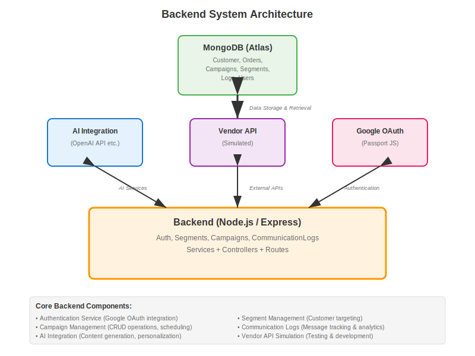
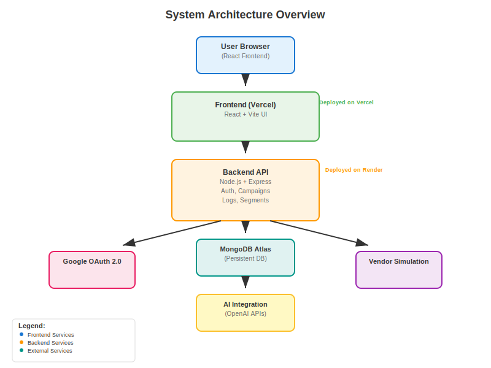

# Xeno CRM - Backend

This is the backend for the Xeno CRM platform, a Node.js application responsible for all business logic, data management, and AI integration.

## Local Setup Instructions

### Prerequisites

* Node.js (v18 or later recommended)
* npm or yarn
* MongoDB instance (local or cloud-based like MongoDB Atlas)

### Installation & Setup

1.  **Clone the repository:**

    ```bash
    git clone <your-repository-url>
    cd <repository-name>/backend
    ```

2.  **Install dependencies:**

    ```bash
    npm install
    ```

3.  **Create environment file:**
    Duplicate the example environment file `.env.example` and rename it to `.env`.

    ```bash
    cp .env.example .env
    ```

4.  **Configure environment variables in `.env`:**
    You must fill in the following values:

    * `MONGODB_URI`: Your MongoDB connection string.
    * `GOOGLE_CLIENT_ID`: Your Google OAuth Client ID.
    * `GOOGLE_CLIENT_SECRET`: Your Google OAuth Client Secret.
    * `JWT_SECRET`: A long, random string for signing JWTs.
    * `AI_API_KEY`: Your API key for the OpenAI-compatible service.

5.  **Run the development server:**

    ```bash
    npm run dev
    ```

    The server will start on the port specified in your `.env` file (defaults to 4000) and will automatically restart on file changes.

## Architecture Diagram

#### Backend Architecture


#### Combined Architecture



## Summary of AI & Tech Used

### Core Technology Stack

* **Node.js & Express:** The runtime and web server framework for building the REST API.
* **MongoDB:** A NoSQL database used for flexible storage of customer, order, and campaign data.
* **Mongoose:** An Object Data Modeling (ODM) library for MongoDB and Node.js, used to define schemas and models.
* **Passport.js (Google OAuth 2.0 Strategy):** Handles user authentication via Google.
* **JSON Web Tokens (JWT):** Used to create secure access tokens for authenticating API requests.
* **Joi:** Provides schema validation for incoming request bodies to ensure data integrity.
* **Jest & Supertest:** Used for writing and running unit and integration tests for the API endpoints.

### AI Tools & Integration

* **OpenAI-compatible API (e.g., GPT-4o mini):** The backend integrates with an external AI service for two primary features:
    1.  **Natural Language to Segmentation Rules:** Converts user prompts in plain English (e.g., "customers who spent > 1000") into structured JSON rules that can be executed against the database.
    2.  **Campaign Message Suggestions:** Generates creative and context-aware marketing messages based on user-defined objectives, products, and tones.

## Known Limitations & Assumptions

* **Simulated Campaign Delivery:** The campaign sending service (`vendorService.js`) is a simulation. It does not integrate with a real email or SMS provider but mimics the behavior with a 90% success rate to test the logging mechanism.
* **Basic AI Fallback:** The fallback parser for segmentation rules (used when the AI API is unavailable) is very basic and only supports simple `field > value` or `field = value` type queries.
* **Limited Test Coverage:** While a testing framework is in place, the test suite is not exhaustive and primarily covers happy paths.
* **Single Authentication Provider:** The application only supports Google OAuth for authentication.
* **No Caching:** No caching layer (like Redis) is implemented, which could be a performance bottleneck under high load.